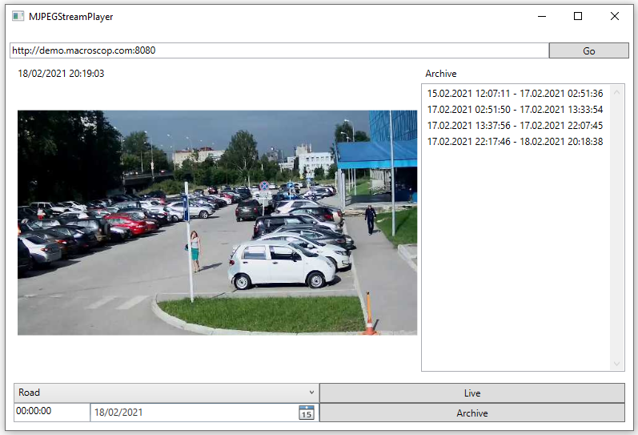

# MJPEGStreamPlayer

MJPEGStreamPlayer is online MJPEG player. Based on class MjpegStreamDecoder for reading and decoding stream from servers broadcast MJPEG. And WPF classes for UI giving a simple way to select camera. 

* UI snapshot

 

Caveats
-------
* Bad practice of using HTTPClient cause exhaust the number of sockets. It's only fit to single video stream.
* Rude and not sophisticated UI/UX design.

### Prerequisites

.NET Framework 4.7.2

## Contributing

Pull requests is appreciated.

## Built With

* [.NET Framework](https://docs.microsoft.com/en-us/dotnet/framework/) - Framework developed by Microsoft that runs primarily on Microsoft Windows.

## Author

* **Denis Vasilenko** -  [tuxtender](https://github.com/tuxtender)

## License 

GNU GENERAL PUBLIC LICENSE  
Version 3, 29 June 2007

This program is free software: you can redistribute it and/or modify
it under the terms of the GNU General Public License as published by
the Free Software Foundation, either version 3 of the License, or
(at your option) any later version.

This program is distributed in the hope that it will be useful,
but WITHOUT ANY WARRANTY; without even the implied warranty of
MERCHANTABILITY or FITNESS FOR A PARTICULAR PURPOSE.  See the
GNU General Public License for more details.

You should have received a copy of the GNU General Public License
along with this program.  If not, see <https://www.gnu.org/licenses/>.

## Acknowledgments
* [MJPEG](https://en.wikipedia.org/wiki/Motion_JPEG)
* [Захват видео с сетевых камер, часть 1](https://habr.com/ru/post/115808/)
* [Asynchronous construction problem of class instance.](https://blog.stephencleary.com/2013/01/async-oop-2-constructors.html)
* [MVVM Pattern](https://www.codeproject.com/Articles/278901/MVVM-Pattern-Made-Simple])
